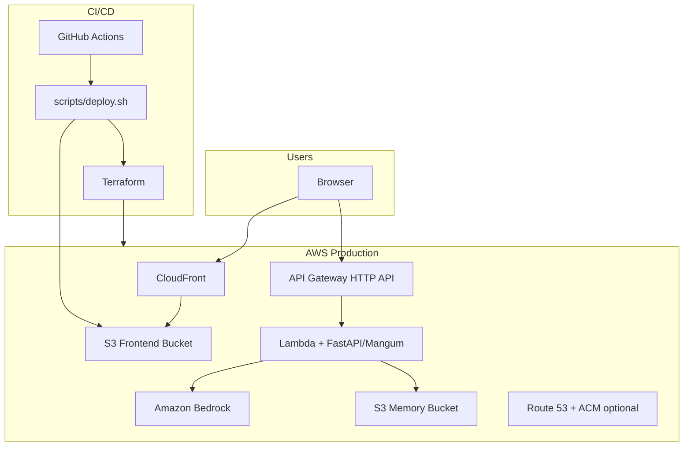

# Strategic Advisor – Your Digital AI Strategic Advisor

Strategic Advisor is a production-style AI assistant that acts as a **digital strategic advisor for technology and delivery leaders**. It combines a modern static web frontend, a serverless FastAPI backend on AWS, and **Amazon Bedrock** for inference—deployed end-to-end with **Terraform (IaC)** and **GitHub Actions CI/CD**.

The project demonstrates how to take an AI concept from prototype to a **multi-environment, observable, infrastructure-as-code deployment** on AWS.

---

## The story: why build a Digital Strategic Advisor?

Technology and delivery leaders rarely have time to step back and think deeply about:

- How to **prioritize strategic initiatives**
- Where **delivery bottlenecks** are really coming from
- How to **introduce AI into existing products and teams** without derailing roadmaps

Strategic Advisor explores a simple idea:

> What if a manager could open a browser and have an always-available, consistent, opinionated AI that speaks the language of strategy, agile delivery, and AI deployment?

This project turns that idea into a working product that:

- Encodes a **persistent advisor personality** via structured context (`backend/context.py` + `backend/data/`)
- Maintains **session-based conversation memory** (local files in dev, S3 in AWS)
- Accepts natural language questions about **Agile, delivery, and AI in production**
- Deploys to **dev, test, and prod** with isolated Terraform workspaces and automated pipelines

---

## High-level architecture

### Local development

| Layer | Technology | Role |
|-------|------------|------|
| **Frontend** | Next.js 16 (App Router, static export) | Chat UI, session handling |
| **Backend** | FastAPI + Uvicorn | REST API, Bedrock calls, memory I/O |
| **AI** | Amazon Bedrock (`converse` API) | LLM inference |
| **Memory** | Local `memory/` directory (default) or S3 | Per-session JSON conversation history |

### Production (AWS)

| Layer | Technology | Role |
|-------|------------|------|
| **CDN** | Amazon CloudFront | HTTPS delivery, SPA routing (`404 → index.html`) |
| **Frontend host** | S3 static website | Hosts Next.js `out/` build |
| **API** | API Gateway HTTP API | Routes `GET /`, `GET /health`, `POST /chat` |
| **Compute** | AWS Lambda (Python 3.12) | FastAPI via Mangum adapter |
| **AI** | Amazon Bedrock | Same model stack as local |
| **Memory** | Private S3 bucket | Encrypted conversation persistence |
| **DNS (optional)** | Route 53 + ACM | Custom domain on CloudFront |



### Repository layout

```
strategicadvisor/
├── frontend/                 # Next.js static export → S3 + CloudFront
│   ├── app/                  # App Router pages
│   └── components/
│       └── strategicai.tsx   # Chat UI, NEXT_PUBLIC_API_URL
├── backend/
│   ├── server.py             # FastAPI app (Bedrock + memory)
│   ├── lambda_handler.py     # Mangum wrapper for Lambda
│   ├── context.py            # System prompt builder
│   ├── resources.py          # Loads data/ assets into prompt
│   ├── deploy.py             # Lambda zip builder (Docker + pip)
│   └── data/                 # facts.json, summary.txt, style.txt, linkedin.pdf
├── terraform/                # AWS infrastructure (IaC)
│   ├── main.tf               # S3, Lambda, API GW, CloudFront, optional DNS
│   ├── variables.tf
│   ├── outputs.tf
│   ├── backend.tf            # S3 remote state (configured at init)
│   └── prod.tfvars           # Production overrides (committed template)
├── scripts/
│   ├── deploy.sh             # Build Lambda + TF apply + frontend sync
│   └── destroy.sh            # Empty buckets + TF destroy
└── .github/workflows/
    ├── deploy.yml            # Automated deploy on push / manual
    └── destroy.yml           # Manual teardown with confirmation
```

---

## AI layer and personality

- **Model**: Amazon Bedrock via the `converse` API (default: `global.amazon.nova-2-lite-v1:0`, configurable in Terraform).
- **Personality**: Built dynamically in `context.py` from `backend/data/` (facts, summary, style, LinkedIn PDF). This keeps domain content **version-controlled and reviewable** separate from application logic.
- **Memory**: Each `session_id` maps to `{session_id}.json`. The frontend sends and reuses `session_id` so conversations continue across turns. In AWS, objects live in a dedicated private S3 bucket; locally they are stored under `MEMORY_DIR` (default `../memory`).

**API endpoints**

| Method | Path | Description |
|--------|------|-------------|
| `GET` | `/` | API metadata (model, storage mode) |
| `GET` | `/health` | Health check for monitoring |
| `POST` | `/chat` | Main chat; returns `{ response, session_id }` |
| `GET` | `/conversation/{session_id}` | Retrieve stored history |

---

## Infrastructure as Code (Terraform)

All production resources are declared in `terraform/` and provisioned per **environment** using Terraform workspaces (`dev`, `test`, `prod`).

### Resources created

- **S3** – Frontend static site bucket (public read for website hosting) and private memory bucket
- **IAM** – Lambda execution role (basic execution, Bedrock, S3)
- **Lambda** – API function packaged from `backend/lambda-deployment.zip`
- **API Gateway v2** – HTTP API with CORS, throttling, and Lambda proxy integration
- **CloudFront** – CDN in front of the S3 website origin; SPA-friendly error handling
- **Route 53 + ACM** (optional) – Custom domain when `use_custom_domain = true`

### State and locking

Remote state uses an **S3 backend** with **DynamoDB locking**, configured at `terraform init` time by `scripts/deploy.sh` and `scripts/destroy.sh`:

| Backend setting | Value |
|-----------------|-------|
| Bucket | `strategicai-terraform-state-{AWS_ACCOUNT_ID}` |
| Key | `{environment}/terraform.tfstate` |
| Lock table | `strategicai-terraform-locks` |
| Encryption | Enabled |

Workspaces isolate state per environment while sharing the same backend configuration pattern.

### Key variables

| Variable | Purpose |
|----------|---------|
| `project_name` | Resource name prefix (lowercase, hyphens) |
| `environment` | `dev` \| `test` \| `prod` |
| `bedrock_model_id` | Bedrock model for Lambda |
| `lambda_timeout` | Lambda timeout (seconds) |
| `api_throttle_*` | API Gateway rate/burst limits |
| `use_custom_domain` | Enable Route 53 + ACM + aliases |
| `root_domain` | Apex domain when custom domain is enabled |

Production-specific values live in `terraform/prod.tfvars` (model, throttling, custom domain). Copy and adjust `root_domain` before deploying prod.

### Outputs

After `terraform apply`, useful outputs include:

- `api_gateway_url` – Injected into frontend as `NEXT_PUBLIC_API_URL`
- `cloudfront_url` – Public site URL
- `s3_frontend_bucket` – Target for `aws s3 sync` of `frontend/out`
- `s3_memory_bucket` – Conversation storage
- `custom_domain_url` – When custom domain is enabled

---

## CI/CD – GitHub Actions

Two workflows automate the operational lifecycle. Both use **OIDC** (`id-token: write`) and `aws-actions/configure-aws-credentials` to assume an IAM role—no long-lived AWS keys in the repository.

### Deploy (`/.github/workflows/deploy.yml`)

**Triggers**

- **Push to `main`** – deploys to `dev` by default
- **`workflow_dispatch`** – choose `dev`, `test`, or `prod`

**Pipeline steps**

1. Checkout code
2. Assume AWS role (`secrets.AWS_ROLE_ARN`)
3. Install Python 3.12, **uv**, Terraform, Node.js 20
4. Run `scripts/deploy.sh` for the target environment:
   - Build Lambda zip (`uv run deploy.py` in `backend/`)
   - `terraform init` + workspace select/create + `terraform apply`
   - Build Next.js with `NEXT_PUBLIC_API_URL` from Terraform output
   - `aws s3 sync` frontend assets to the frontend bucket
5. Read Terraform outputs and **invalidate CloudFront** cache (`/*`)
6. Print deployment summary (CloudFront URL, API URL, bucket name)

Each GitHub **Environment** (`dev` / `test` / `prod`) can hold environment-specific secrets and protection rules.

### Destroy (`/.github/workflows/destroy.yml`)

**Trigger**: `workflow_dispatch` only (never on push).

**Safety**: Requires typing the environment name in a `confirm` input; the job fails if it does not match.

**Steps**: Assume AWS role → run `scripts/destroy.sh` (empty S3 buckets, `terraform destroy`).

Use this workflow to tear down non-production sandboxes and control cost.

### Required GitHub secrets

Configure these in each GitHub Environment (or repository secrets):

| Secret | Purpose |
|--------|---------|
| `AWS_ROLE_ARN` | IAM role for OIDC federation (deploy/destroy) |
| `AWS_ACCOUNT_ID` | AWS account ID |
| `DEFAULT_AWS_REGION` | Region (e.g. `us-east-1`) |

### One-time AWS prerequisites

Before the first pipeline run:

1. **Terraform state backend** – S3 bucket `strategicai-terraform-state-{account_id}` and DynamoDB table `strategicai-terraform-locks`
2. **GitHub OIDC provider + IAM role** – Trust policy for your repo; permissions for Terraform, S3, Lambda, API Gateway, CloudFront, Bedrock, etc.
3. **Bedrock model access** – Enable the chosen model in the Bedrock console for the deployment region
4. **(Optional) Route 53 hosted zone** – If using `use_custom_domain` in prod

---

## Deployment

### Automated (recommended)

Push to `main` or run **Actions → Deploy Strategic Advisor → Run workflow**, then select the environment.

### Manual (local)

From the project root, with AWS CLI credentials configured:

```bash
# Deploy to dev (default), test, or prod
./scripts/deploy.sh dev
./scripts/deploy.sh prod

# Destroy an environment (empties S3 buckets first)
./scripts/destroy.sh dev
```

`deploy.sh` orchestrates: Lambda package build → Terraform apply → Next.js production build → S3 sync.

**Lambda packaging** uses Docker (`public.ecr.aws/lambda/python:3.12`) to install Linux-compatible dependencies into `lambda-deployment.zip`. Docker must be available for local deploys.

---

## Running locally

Run the backend and frontend separately for fast iteration.

### Prerequisites

- Python 3.12+ and [uv](https://docs.astral.sh/uv/)
- Node.js 20+
- AWS credentials with **Bedrock** access in your chosen region
- Docker (only if building the Lambda zip locally)

### 1. Backend (FastAPI)

From `backend/`:

```bash
uv sync

# AWS region and Bedrock model (optional overrides)
export DEFAULT_AWS_REGION=us-east-1
export BEDROCK_MODEL_ID=global.amazon.nova-2-lite-v1:0

# Local memory (default: ../memory). Set USE_S3=true + S3_BUCKET for S3-backed dev.
export USE_S3=false

uv run python server.py
```

API runs at `http://localhost:8000`.

### 2. Frontend (Next.js)

From `frontend/`:

```bash
npm install
npm run dev
```

Open `http://localhost:3000`. The chat component calls `NEXT_PUBLIC_API_URL` or falls back to `http://localhost:8000`.

### Environment template

See `.env.example` for project-level AWS and naming variables used by deploy scripts.

---

## Key user scenarios

A manager can use Strategic Advisor to:

- **Stress-test a strategy** – “We’re planning to roll out a new platform—what risks am I not seeing?”
- **Diagnose delivery issues** – “Our teams keep missing sprint goals. What should I look at first?”
- **Explore AI in production** – “How would you phase an AI feature rollout to minimize risk?”
- **Prepare for stakeholder conversations** – “Help me explain the value of observability to non-technical executives.”

---

## Implementation highlights

- **Typed API contracts** – `ChatRequest` / `ChatResponse` Pydantic models for clear extension points
- **Personality as data** – `data/` + `context.py` instead of hard-coded prompts in application code
- **Serverless parity** – Same `server.py` runs locally (Uvicorn) and on Lambda (Mangum)
- **Static frontend export** – `output: 'export'` in `next.config.ts` for S3/CloudFront hosting without a Node server
- **Environment isolation** – Terraform workspaces + per-environment GitHub Environments
- **Operational safety** – Destroy workflow requires explicit confirmation; S3 buckets use `force_destroy` for clean teardown in non-prod

---

## How a hiring manager can read this repo

Suggested entry points:

| Focus | Where to look |
|-------|----------------|
| **Product & UX** | `frontend/app/page.tsx`, `frontend/components/strategicai.tsx` |
| **AI integration** | `backend/server.py`, `backend/context.py`, `backend/data/` |
| **Cloud architecture** | `terraform/main.tf`, `terraform/variables.tf` |
| **CI/CD & ops** | `.github/workflows/deploy.yml`, `scripts/deploy.sh` |
| **Engineering hygiene** | `.gitignore`, workspace/state patterns, environment-based secrets |

---

## Possible extensions

Building blocks already in place; natural next steps include:

- **CI quality gates** – lint/test workflows on pull requests before deploy
- **Observability** – CloudWatch dashboards, structured logging, X-Ray on Lambda
- **Auth** – Cognito or API keys in front of API Gateway
- **RAG / tool use** – Ground responses in Jira, ADO, or GitHub via Bedrock agents
- **WAF & hardened S3** – CloudFront OAC instead of public website endpoint where policy requires it

The current codebase is a **minimal but production-shaped core**: deployable, multi-environment, and designed to show strategy, delivery, and real-world AI deployment on AWS.
